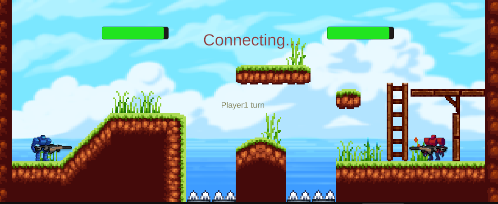

<!--
README.md for Two-Robot Arena
-->

# 🎮 Two-Robot Arena

A 2D local/Wi-Fi multiplayer shooter built in Unity. Two robots—**Red** vs **Blue**—face off in a compact arena, blasting each other until one remains.

---

## 📸 Preview

  

---

## 🚀 Features

- **Local & Online Multiplayer**  
  Connect up to two clients to a headless TCP server.  
- **Responsive 2D Controls**  
  - **Red**: ←/→ to move, ↑ to go up in the ladder, O to shoot and L to jump
  - **Blue**: A/D to move, W to go up in the ladder, Q to shoot  and Spacebar to jump
- **Special blocks & Mechanics**  
  - Ladder that can be used to reach higher locations
  - Instant-kill spikes in the lower arena void
- **Headless Server**  
  Lightweight Python implementation for server and client
---
## External frameworks çand libraries:
- Unity
---
## 👥 Team Contributions

| Member           | Role & Responsibilities                                                      |
|------------------|-------------------------------------------------------------------------------|
| Jairo López      | Designed the UI of Levels, Initial Scene and Level selector. Mechanics of Spikes and stairs FloorController for jumping + Communication protocol                 |
| David Gutiérrez  | Created the healthbar and health mechanic for robots dying in spikes, etc. and proper movement of the robots + Client Implementation                             |
| Sara González    | Build the robots and gun implementations + Server implementation                                                                                                 |

---
## 🛠️ Concurrent Programming Methods

Below is an overview of the primary concurrency techniques and APIs used in this project:

| Context     | Language / API                 | Purpose                                                                                       |
|-------------|--------------------------------|-----------------------------------------------------------------------------------------------|
| **Client**  | **C# `async` / `await`**       | - Perform non-blocking network I/O (`ConnectAsync`, `ReadAsync`)                              |
|             | **C# `Task.Delay()`**             | - Retry logic for reconnecting every 500 ms without freezing the main game loop               |
|             | **C# `Queue<string>`**            | - Buffer incoming messages safely for processing on Unity’s main thread                       |
|             | **C# `OnApplicationQuit()`**      | - Gracefully close sockets/streams when the application exits                                |
| **Server**  | **Python `threading.Thread`**  | - Handle each client connection in its own parallel thread                                   |
|             | **Python `threading.Lock`**    | - Protect shared data structures (`players` dict) from race conditions                       |
|             | **Python `threading.Barrier`** | - Synchronize both player threads at key phases (assignment, game start, turn transitions)   |
|             | **Python `socket.recv/send`**| - Perform network I/O on worker threads without impacting other threads                      |
|             | **Python `signal.signal(SIGINT,…)`**  | - Catch Ctrl+C to trigger a clean, orderly server shutdown                                   |

### How it works in practice

1. **Unity Client**  
   - `Start()` is marked `async` and uses `await` to connect and then listens for server messages with `await stream.ReadAsync()`.  
   - All network calls are non-blocking, so Unity’s Update loop remains smooth and unblocked.

2. **Python Server**  
   - The main thread accepts TCP connections and spawns a new `threading.Thread` for each client.  
   - Inside each `handle_client` thread, `Barrier.wait()` calls ensure both clients stay in sync before the game starts and before each turn.  
   - `Lock` calls guard modifications to the shared `players` map, preventing concurrent write issues.  
   - On Ctrl+C (`SIGINT`), `signal.signal` invokes `shutdown_server()`, closing all sockets cleanly.  

